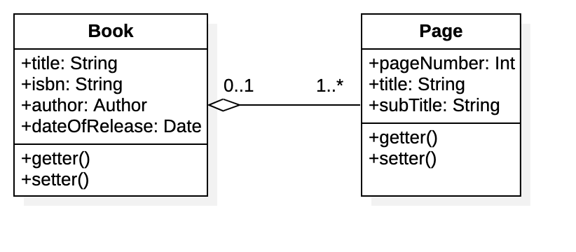
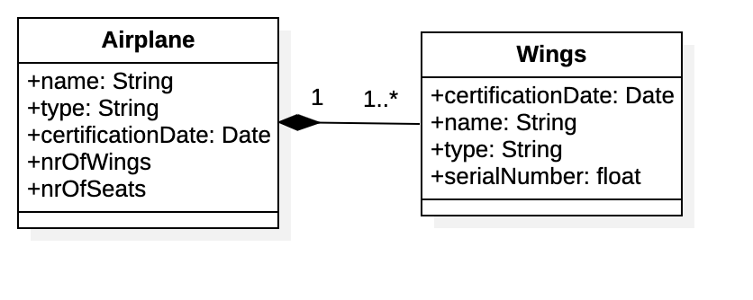
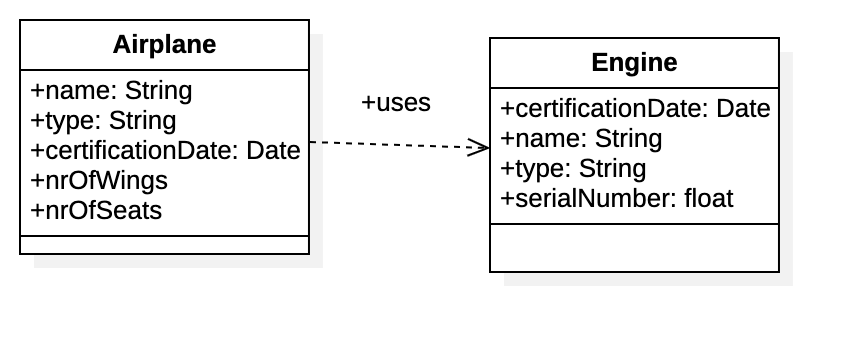
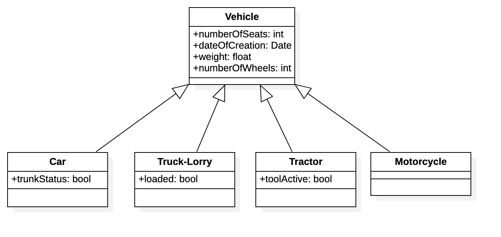
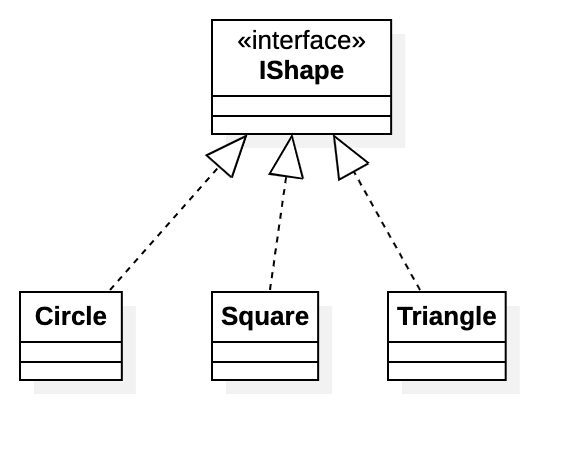

# UML Classes

## Sources

The following sources have been used:

- https://en.wikipedia.org/wiki/Class_diagram

## General

Class diagrams are used to describe attributes (variables), methods (operations) and the relationship between objects.

A class is build with three sections:

- top: name of the class. (if its an interface, its above the name).
- center: attributes (variables).
- bottom: methods (operations).

## Visibility

An attribute or method can have one of the four different visibilities:  
`+` Public  
`-` Private  
`#` Protected  
`~` Package

## Relationships

### Association

### Aggregation

### Composition

### Dependency

### Inheritance

### Realization

