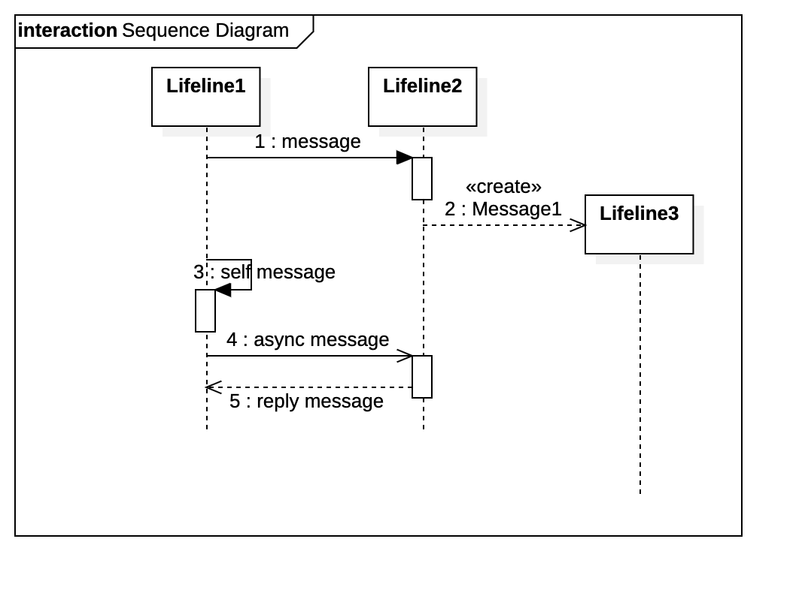

# UML Sequence Diagram

## Sources

The following sources have been used:

- https://en.wikipedia.org/wiki/Sequence_diagram
- https://de.wikipedia.org/wiki/Sequenzdiagramm

## General

Sequence Diagrams show how objects and methods interact with each other. You can see what will be created and in which order (time).

